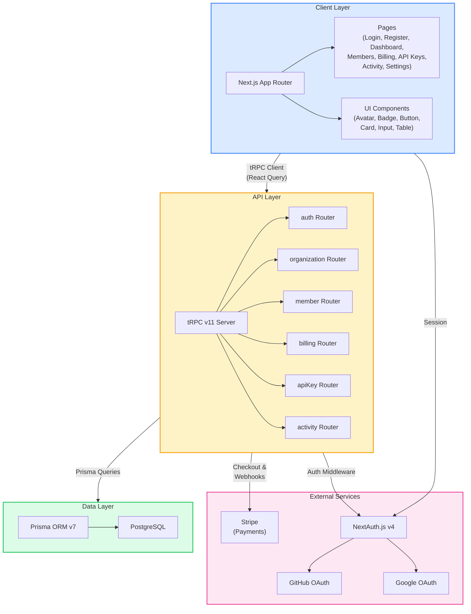
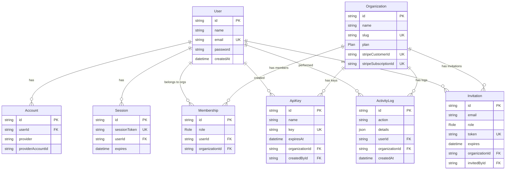
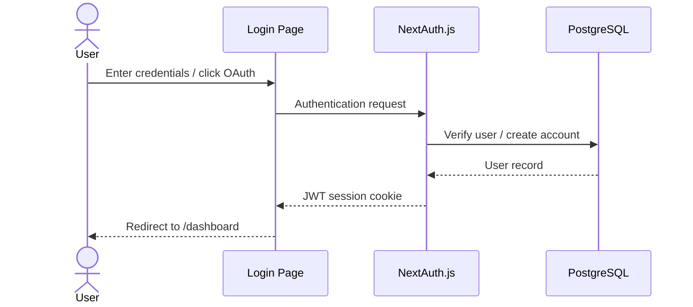

# SaaS Launchpad

[](https://nextjs.org/)
[](https://www.typescriptlang.org/)
[](https://www.prisma.io/)
[](https://trpc.io/)
[](https://stripe.com/)
[](https://tailwindcss.com/)
[](https://www.docker.com/)
[](LICENSE)

Production-ready multi-tenant SaaS boilerplate with authentication, organizations, Stripe billing, API key management, and activity logging. Built with Next.js 16, tRPC v11, Prisma 7, and TypeScript -- designed to let you skip months of infrastructure work and focus on your product.

---

## Quick Start (One Command)

**Prerequisites:** [Node.js 22+](https://nodejs.org/), [Docker](https://www.docker.com/get-started/)

```bash
git clone https://github.com/yourusername/saas-launchpad.git
cd saas-launchpad
bash scripts/setup.sh      # Linux/macOS
# .\scripts\setup.ps1      # Windows PowerShell
npm run dev
```

> **Demo Credentials**
>
> Email: `demo@example.com`
> Password: `password123`
>
> Open http://localhost:3000 after starting the dev server.

The setup script handles everything: starts PostgreSQL via Docker, installs dependencies, runs database migrations, and seeds demo data.

---

## Features

### Core Platform
- **Authentication** -- Email/password + GitHub + Google OAuth via NextAuth.js (JWT strategy)
- **Multi-Tenancy** -- Organizations with Owner/Admin/Member role hierarchy
- **Stripe Billing** -- Subscriptions, checkout, customer portal, and webhook handling
- **API Keys** -- Generate, manage, and revoke keys with SHA-256 hashed storage
- **Activity Logs** -- Complete audit trail for all organization actions
- **Type-Safe API** -- End-to-end typesafe with tRPC v11 + Zod validation
- **Admin Panel** -- Owner-only system overview with user metrics, org-level analytics, and health indicators

### Advanced Features
- **Rate Limiting** -- Token-bucket algorithm with per-route limits and standard `X-RateLimit-*` headers
- **Health Checks** -- `/api/health` endpoint reporting uptime, database connectivity, and version
- **Structured Logging** -- JSON logs in production, pretty-printed in dev, with configurable levels and request ID tracking
- **Optimistic Mutations** -- Generic hook for instant UI updates with automatic rollback on failure
- **Email Templates** -- React-based invitation and welcome emails ready for Resend / SendGrid integration
- **Custom Hooks** -- `useDebounce`, `useLocalStorage`, and `useDebouncedCallback` for common UI patterns

### Developer Experience
- **Dark Mode** -- System-aware with manual toggle
- **Docker** -- One-command development environment
- **CI/CD** -- GitHub Actions for lint, type-check, and build
- **Architecture Decision Records** -- Documented rationale for every major technical choice

## Tech Stack

| Layer | Technology |
|-------|-----------|
| Framework | Next.js 16 (App Router) |
| Language | TypeScript 5 |
| API | tRPC v11 |
| Database | PostgreSQL + Prisma 7 |
| Auth | NextAuth.js v4 (JWT) |
| Payments | Stripe |
| Styling | Tailwind CSS v4 |
| Testing | Vitest + Playwright |
| Deployment | Docker + Vercel/Railway |

## Architecture



## Database Schema



**Enums:** `Role` (OWNER, ADMIN, MEMBER) and `Plan` (FREE, PRO, ENTERPRISE).

See the [full ER diagram](docs/diagrams/database-er.md) with all fields and annotations.

## API Reference

All API routes are served via tRPC at `/api/trpc/[trpc]`. Three middleware levels control access:

| Level | Middleware | Description |
|-------|-----------|-------------|
| **Public** | `publicProcedure` | No authentication required |
| **Protected** | `protectedProcedure` / `orgProcedure` | Requires authenticated session |
| **Admin** | `adminProcedure` | Requires ADMIN or OWNER role in the organization |

### Routes

| Route | Type | Access | Description |
|-------|------|--------|-------------|
| `auth.register` | mutation | Public | Register a new user (name, email, password) |
| `auth.me` | query | Protected | Get current user profile |
| `organization.create` | mutation | Protected | Create a new organization (caller becomes Owner) |
| `organization.list` | query | Protected | List organizations the user belongs to |
| `organization.getById` | query | Protected | Get full organization details with members |
| `organization.update` | mutation | Admin | Update organization name or logo |
| `organization.delete` | mutation | Protected | Delete organization (Owner only) |
| `member.list` | query | Protected | List all members of an organization |
| `member.invite` | mutation | Admin | Send an email invitation with role |
| `member.removeMember` | mutation | Admin | Remove a member (cannot remove Owner) |
| `member.updateRole` | mutation | Protected | Change a member's role (Owner only) |
| `billing.plans` | query | Protected | List available subscription plans |
| `billing.getSubscription` | query | Protected | Get current org subscription status |
| `billing.createCheckoutSession` | mutation | Protected | Create a Stripe Checkout session |
| `billing.createPortalSession` | mutation | Protected | Open the Stripe Customer Portal |
| `apiKey.list` | query | Protected | List organization API keys (hashed) |
| `apiKey.create` | mutation | Admin | Generate a new API key (returns plain key once) |
| `apiKey.revoke` | mutation | Admin | Delete an API key |
| `activity.list` | query | Protected | Paginated activity log for an organization |

See the [full API structure diagram](docs/diagrams/api-structure.md) for a visual overview.

## Authentication

NextAuth.js is configured with a **JWT strategy** -- no server-side session database lookups on every request. Supports three providers:

1. **Credentials** -- Email + password (bcryptjs with 12 salt rounds)
2. **GitHub OAuth** -- One-click sign in
3. **Google OAuth** -- One-click sign in



The `protectedProcedure` tRPC middleware calls `getServerSession()` on every API request to verify the JWT token. Organization-scoped procedures (`orgProcedure`, `adminProcedure`) additionally verify role-based membership.

See the [full authentication flow diagrams](docs/diagrams/auth-flow.md) for detailed sequences.

## Stripe Billing

Three subscription tiers with full Stripe integration:

| Plan | Price | Members | API Requests | Stripe Price ID |
|------|-------|---------|-------------|-----------------|
| Free | $0/mo | 3 | 1,000/mo | `null` |
| Pro | $29/mo | 20 | 50,000/mo | `STRIPE_PRO_PRICE_ID` |
| Enterprise | $99/mo | Unlimited | Unlimited | `STRIPE_ENTERPRISE_PRICE_ID` |

**Webhook events handled** at `/api/webhooks/stripe`:
- `checkout.session.completed` -- Activate subscription after payment
- `customer.subscription.updated` -- Sync plan changes
- `customer.subscription.deleted` -- Downgrade to Free

See the [full Stripe payment flow diagram](docs/diagrams/stripe-flow.md) for the complete sequence.

## Screenshots

Interactive HTML mockups of every major page (open in a browser):

| Page | File | Description |
|------|------|-------------|
| **Hero Dashboard** | [hero-saas.html](docs/screenshots/hero-saas.html) | Dark-mode dashboard with glassmorphism cards, animated sparklines, revenue chart, and live activity feed |
| Landing Page | [landing-page.html](docs/screenshots/landing-page.html) | Marketing page with hero, features grid, and pricing cards |
| Login | [login.html](docs/screenshots/login.html) | OAuth buttons + email/password form |
| Dashboard | [dashboard.html](docs/screenshots/dashboard.html) | Stat cards and recent activity feed |
| Members | [members.html](docs/screenshots/members.html) | Team roster, invite form, pending invitations |
| Billing | [billing.html](docs/screenshots/billing.html) | Current plan status and plan comparison cards |
| API Keys | [api-keys.html](docs/screenshots/api-keys.html) | Key management with creation alert |

## Diagrams

Detailed Mermaid diagrams documenting the full system:

| Diagram | File | Description |
|---------|------|-------------|
| System Architecture | [architecture.md](docs/diagrams/architecture.md) | Layered overview of client, API, data, and external services |
| Database Schema | [database-er.md](docs/diagrams/database-er.md) | Full ER diagram with all models and relationships |
| Authentication Flow | [auth-flow.md](docs/diagrams/auth-flow.md) | Credentials, OAuth, and session handling sequences |
| Stripe Payment Flow | [stripe-flow.md](docs/diagrams/stripe-flow.md) | Checkout, webhook, and portal sequences |
| API Structure | [api-structure.md](docs/diagrams/api-structure.md) | tRPC router hierarchy with access levels |
| CI/CD Pipeline | [ci-cd-pipeline.md](docs/diagrams/ci-cd-pipeline.md) | GitHub Actions workflow visualization |

## Architecture Decision Records

Key technical decisions are documented as ADRs in [`docs/adr/`](docs/adr/):

| ADR | Decision | Summary |
|-----|----------|---------|
| [001](docs/adr/001-trpc-over-rest.md) | tRPC over REST/GraphQL | End-to-end type safety, no code generation, 2 KB client bundle |
| [002](docs/adr/002-jwt-over-database-sessions.md) | JWT over database sessions | No per-request DB lookups, simpler serverless deployment, sub-millisecond auth |
| [003](docs/adr/003-org-based-multi-tenancy.md) | Org-based multi-tenancy | Row-level isolation via membership checks, single database, Prisma-native |

## Development Setup

### Manual Setup (Step by Step)

#### 1. Clone and install

```bash
git clone https://github.com/yourusername/saas-launchpad.git
cd saas-launchpad
npm install
```

#### 2. Set up environment

```bash
cp .env.example .env
# Edit .env with your values (see Environment Variables section below)
```

#### 3. Start database

```bash
npm run db:start
```

#### 4. Run migrations and seed

```bash
npm run db:migrate
npm run db:seed
```

#### 5. Start development server

```bash
npm run dev
```

Open [http://localhost:3000](http://localhost:3000). Login with `demo@example.com` / `password123`.

### NPM Scripts Reference

| Script | Command | Description |
|--------|---------|-------------|
| `npm run dev` | `next dev` | Start Next.js dev server |
| `npm run build` | `next build` | Production build |
| `npm run setup` | `bash scripts/setup.sh` | Full one-command setup |
| `npm run db:start` | `docker compose up -d db` | Start PostgreSQL |
| `npm run db:stop` | `docker compose down` | Stop all containers |
| `npm run db:migrate` | `npx prisma migrate dev` | Run database migrations |
| `npm run db:seed` | `npx prisma db seed` | Seed demo data |
| `npm run db:studio` | `npx prisma studio` | Open Prisma Studio GUI |
| `npm run type-check` | `tsc --noEmit` | TypeScript type checking |
| `npm run test` | `vitest run` | Run unit tests once |
| `npm run test:watch` | `vitest` | Run tests in watch mode |
| `npm run lint` | `eslint` | Lint with ESLint |

## Project Structure

```
saas-launchpad/
├── src/
│   ├── app/
│   │   ├── (auth)/                    # Auth pages
│   │   │   ├── login/page.tsx         # Login with OAuth + credentials
│   │   │   └── register/page.tsx      # Registration form
│   │   ├── (dashboard)/               # Protected dashboard pages
│   │   │   ├── dashboard/page.tsx     # Overview with stats and activity
│   │   │   ├── members/page.tsx       # Team management and invitations
│   │   │   ├── billing/page.tsx       # Subscription plans and Stripe portal
│   │   │   ├── api-keys/page.tsx      # API key generation and management
│   │   │   ├── activity/page.tsx      # Paginated audit log
│   │   │   ├── settings/page.tsx      # Organization settings
│   │   │   └── admin/page.tsx         # Owner-only admin super panel
│   │   ├── api/
│   │   │   ├── auth/[...nextauth]/    # NextAuth API route
│   │   │   ├── trpc/[trpc]/           # tRPC API handler
│   │   │   ├── health/               # Health check endpoint
│   │   │   └── webhooks/stripe/       # Stripe webhook handler
│   │   ├── layout.tsx                 # Root layout with providers
│   │   └── page.tsx                   # Landing page
│   ├── components/ui/                 # Reusable UI components
│   │   ├── Avatar.tsx
│   │   ├── Badge.tsx
│   │   ├── Button.tsx
│   │   ├── Card.tsx
│   │   ├── Input.tsx
│   │   └── Table.tsx
│   ├── lib/
│   │   ├── auth.ts                    # NextAuth configuration
│   │   ├── auth-utils.ts             # Password hashing, role helpers
│   │   ├── db.ts                      # Prisma client singleton
│   │   ├── logger.ts                  # Structured logging (JSON prod, pretty dev)
│   │   ├── rate-limit.ts             # Token-bucket rate limiter
│   │   ├── stripe.ts                  # Stripe client + PLANS config
│   │   ├── trpc.tsx                   # tRPC React client
│   │   ├── hooks/
│   │   │   ├── use-debounce.ts       # Debounce hook for search/filter inputs
│   │   │   ├── use-local-storage.ts  # Persistent state with cross-tab sync
│   │   │   └── use-optimistic-mutation.ts # Generic optimistic update hook
│   │   └── email/templates/
│   │       ├── invitation.tsx         # Member invitation email
│   │       └── welcome.tsx            # New user welcome email
│   ├── server/
│   │   ├── trpc.ts                    # tRPC init, context, middleware
│   │   └── routers/
│   │       ├── _app.ts               # Root appRouter (merges all routers)
│   │       ├── auth.ts               # register, me
│   │       ├── organization.ts       # create, list, getById, update, delete
│   │       ├── member.ts             # list, invite, removeMember, updateRole
│   │       ├── billing.ts            # plans, getSubscription, checkout, portal
│   │       ├── apiKey.ts             # list, create, revoke
│   │       └── activity.ts           # list (paginated)
│   ├── generated/prisma/             # Prisma generated client (gitignored)
│   └── types/                        # TypeScript declarations
├── prisma/
│   ├── schema.prisma                  # Database schema (8 models, 2 enums)
│   ├── migrations/                    # SQL migration files
│   └── seed.ts                        # Demo data seeder
├── tests/
│   └── unit/
│       ├── auth-utils.test.ts        # Password hashing/verification tests
│       └── stripe.test.ts            # Plans configuration tests
├── scripts/
│   ├── setup.sh                       # One-command setup (Linux/macOS)
│   ├── setup.ps1                      # One-command setup (Windows)
│   └── env.example                    # Default .env for local development
├── docs/
│   ├── adr/                           # Architecture Decision Records (3 files)
│   ├── diagrams/                      # Mermaid architecture diagrams (6 files)
│   └── screenshots/                   # HTML UI mockups (7 files)
├── .github/workflows/ci.yml          # GitHub Actions CI pipeline
├── docker-compose.yml                 # PostgreSQL for development
├── Dockerfile                         # Production multi-stage build
├── CONTRIBUTING.md                    # Contributor guide
└── package.json
```

## Environment Variables

| Variable | Description | Required |
|----------|-------------|----------|
| `DATABASE_URL` | PostgreSQL connection string | Yes |
| `NEXTAUTH_URL` | App URL (e.g., `http://localhost:3000`) | Yes |
| `NEXTAUTH_SECRET` | Random secret for JWT signing | Yes |
| `GITHUB_CLIENT_ID` | GitHub OAuth app client ID | No |
| `GITHUB_CLIENT_SECRET` | GitHub OAuth app client secret | No |
| `GOOGLE_CLIENT_ID` | Google OAuth client ID | No |
| `GOOGLE_CLIENT_SECRET` | Google OAuth client secret | No |
| `STRIPE_SECRET_KEY` | Stripe secret API key | Yes |
| `STRIPE_WEBHOOK_SECRET` | Stripe webhook endpoint signing secret | Yes |
| `STRIPE_PRO_PRICE_ID` | Stripe price ID for Pro plan ($29/mo) | Yes |
| `STRIPE_ENTERPRISE_PRICE_ID` | Stripe price ID for Enterprise plan ($99/mo) | Yes |

For local development, the setup script copies `scripts/env.example` to `.env` with working defaults. OAuth and Stripe features require real API keys.

## Testing

Unit tests are written with [Vitest](https://vitest.dev/) and located in `tests/unit/`.

```bash
npm run test           # Run all unit tests
npm run test:watch     # Run tests in watch mode
npx vitest run tests/unit/auth-utils.test.ts   # Run a specific test file
```

### Test Coverage

| Suite | Tests | What's covered |
|-------|-------|----------------|
| `auth-utils.test.ts` | 6 | Password hashing with bcryptjs, unique salts, verification |
| `stripe.test.ts` | 6 | PLANS array structure, required fields, price ordering, enum slugs |

## Stripe Setup

1. Create a [Stripe account](https://dashboard.stripe.com/register)
2. Create two Products with monthly recurring prices:
   - **Pro** at $29/month
   - **Enterprise** at $99/month
3. Copy each product's price ID to your `.env` file
4. Set up a webhook endpoint pointing to `https://yourdomain.com/api/webhooks/stripe`
5. Select events: `checkout.session.completed`, `customer.subscription.updated`, `customer.subscription.deleted`
6. Copy the webhook signing secret to `.env` as `STRIPE_WEBHOOK_SECRET`

For local development, use the [Stripe CLI](https://stripe.com/docs/stripe-cli) to forward webhooks:

```bash
stripe listen --forward-to localhost:3000/api/webhooks/stripe
```

## Deployment

### Vercel + Railway

1. **Database:** Create a PostgreSQL instance on [Railway](https://railway.app) or [Neon](https://neon.tech)
2. **App:** Import the repo in [Vercel](https://vercel.com)
3. **Environment:** Add all environment variables in the Vercel dashboard
4. **Build:** Vercel auto-detects Next.js -- builds run `prisma generate` + `next build`
5. **Webhooks:** Update your Stripe webhook endpoint to the production URL
6. **DNS:** Configure your custom domain in Vercel

### Docker (self-hosted)

```bash
# Build the production image
docker build -t saas-launchpad .

# Run with environment variables
docker run -p 3000:3000 --env-file .env saas-launchpad
```

### CI/CD Pipeline

Every push to `main` and every pull request triggers the GitHub Actions pipeline:

1. **Lint** (ESLint) and **Type Check** (tsc) run in parallel
2. **Build** (next build) runs after both pass
3. Vercel/Railway auto-deploys on merge to `main`

See the [CI/CD pipeline diagram](docs/diagrams/ci-cd-pipeline.md) for a visual overview.

## Contributing

We welcome contributions! See [CONTRIBUTING.md](CONTRIBUTING.md) for:

- Prerequisites and setup instructions
- Development workflow (branch, code, test, PR)
- Code style guidelines (TypeScript strict, Tailwind, tRPC patterns)
- Database migration workflow

## Roadmap

Planned features for future releases:

- **SSO / SAML** -- Enterprise single sign-on with SAML 2.0 and OIDC
- **Webhook Management** -- User-configurable outbound webhooks with retry and delivery logs
- **Team Permissions Matrix** -- Fine-grained resource-level permissions beyond role hierarchy
- ~~**API Rate Limiting**~~ -- Shipped: token-bucket algorithm with pre-configured limiters for API, auth, and sensitive operations
- ~~**Email Notifications**~~ -- Shipped: React email templates for invitations and welcome emails (Resend/SendGrid integration ready)
- **Audit Log Export** -- CSV/JSON export and webhook streaming for compliance
- **Multi-Region Support** -- Database read replicas and edge-aware routing

## License

MIT
