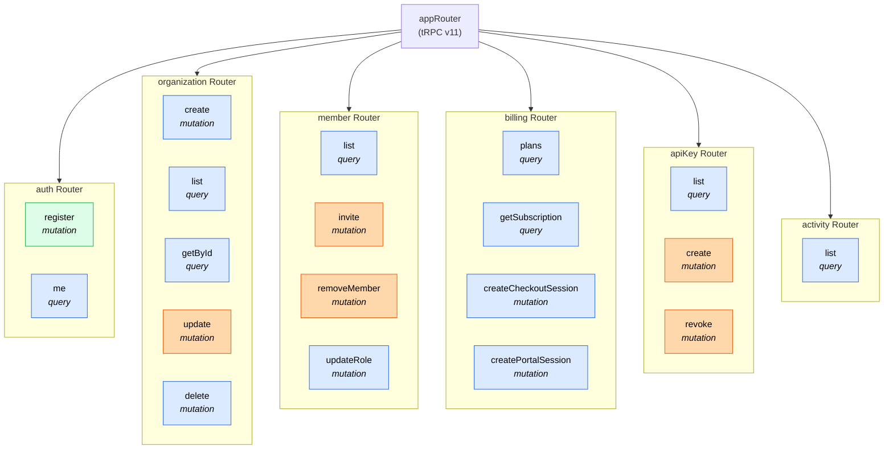

# API Structure

### Access Level Legend

| Color | Level | Middleware | Description |
|-------|-------|-----------|-------------|
| Green | **Public** | `publicProcedure` | No authentication required |
| Blue | **Protected** | `protectedProcedure` / `orgProcedure` | Requires authenticated session (and org membership for org-scoped routes) |
| Orange | **Admin** | `adminProcedure` | Requires ADMIN or OWNER role in the organization |

### Route Details

| Route | Type | Access | Description |
|-------|------|--------|-------------|
| `auth.register` | mutation | Public | Register a new user account |
| `auth.me` | query | Protected | Get current user profile |
| `organization.create` | mutation | Protected | Create a new organization |
| `organization.list` | query | Protected | List user's organizations |
| `organization.getById` | query | Protected | Get organization details |
| `organization.update` | mutation | Admin | Update organization name/logo |
| `organization.delete` | mutation | Protected | Delete organization (Owner only) |
| `member.list` | query | Protected | List organization members |
| `member.invite` | mutation | Admin | Invite a user by email |
| `member.removeMember` | mutation | Admin | Remove a member (not Owner) |
| `member.updateRole` | mutation | Protected | Change member role (Owner only) |
| `billing.plans` | query | Protected | List available plans |
| `billing.getSubscription` | query | Protected | Get org subscription status |
| `billing.createCheckoutSession` | mutation | Protected | Start Stripe checkout |
| `billing.createPortalSession` | mutation | Protected | Open Stripe customer portal |
| `apiKey.list` | query | Protected | List organization API keys |
| `apiKey.create` | mutation | Admin | Generate a new API key |
| `apiKey.revoke` | mutation | Admin | Revoke an existing API key |
| `activity.list` | query | Protected | List org activity logs (paginated) |
