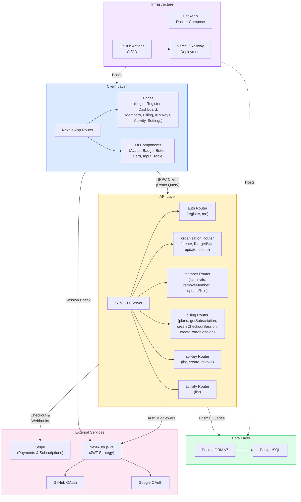

# System Architecture

```mermaid
graph TD
    subgraph Client["Client Layer"]
        style Client fill:#dbeafe,stroke:#3b82f6,stroke-width:2px
        AppRouter["Next.js App Router"]
        Pages["Pages<br/>(Login, Register, Dashboard,<br/>Members, Billing, API Keys,<br/>Activity, Settings)"]
        Components["UI Components<br/>(Avatar, Badge, Button,<br/>Card, Input, Table)"]
        AppRouter --> Pages
        AppRouter --> Components
    end

    subgraph API["API Layer"]
        style API fill:#fef3c7,stroke:#f59e0b,stroke-width:2px
        tRPC["tRPC v11 Server"]
        AuthRouter["auth Router<br/>(register, me)"]
        OrgRouter["organization Router<br/>(create, list, getById,<br/>update, delete)"]
        MemberRouter["member Router<br/>(list, invite,<br/>removeMember, updateRole)"]
        BillingRouter["billing Router<br/>(plans, getSubscription,<br/>createCheckoutSession,<br/>createPortalSession)"]
        ApiKeyRouter["apiKey Router<br/>(list, create, revoke)"]
        ActivityRouter["activity Router<br/>(list)"]
        tRPC --> AuthRouter
        tRPC --> OrgRouter
        tRPC --> MemberRouter
        tRPC --> BillingRouter
        tRPC --> ApiKeyRouter
        tRPC --> ActivityRouter
    end

    subgraph Data["Data Layer"]
        style Data fill:#dcfce7,stroke:#22c55e,stroke-width:2px
        Prisma["Prisma ORM v7"]
        PG["PostgreSQL"]
        Prisma --> PG
    end

    subgraph External["External Services"]
        style External fill:#fce7f3,stroke:#ec4899,stroke-width:2px
        Stripe["Stripe<br/>(Payments & Subscriptions)"]
        NextAuth["NextAuth.js v4<br/>(JWT Strategy)"]
        GitHub["GitHub OAuth"]
        Google["Google OAuth"]
        NextAuth --> GitHub
        NextAuth --> Google
    end

    subgraph Infra["Infrastructure"]
        style Infra fill:#f3e8ff,stroke:#a855f7,stroke-width:2px
        Docker["Docker &<br/>Docker Compose"]
        CICD["GitHub Actions<br/>CI/CD"]
        Vercel["Vercel / Railway<br/>Deployment"]
        CICD --> Vercel
    end

    Client -->|"tRPC Client<br/>(React Query)"| API
    API -->|"Prisma Queries"| Data
    API -->|"Checkout &<br/>Webhooks"| Stripe
    Client -->|"Session Check"| NextAuth
    API -->|"Auth Middleware"| NextAuth
    Infra -.->|"Hosts"| Client
    Infra -.->|"Hosts"| Data
```
