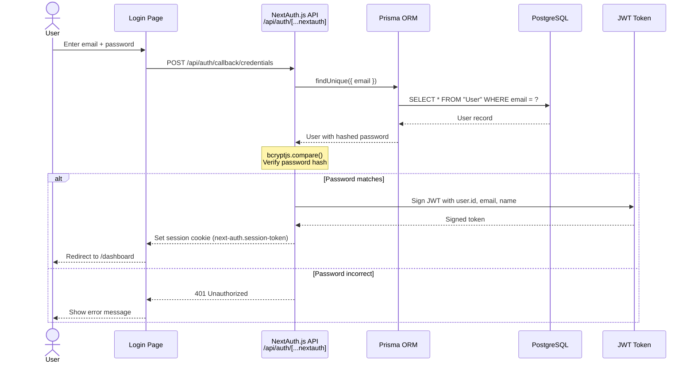
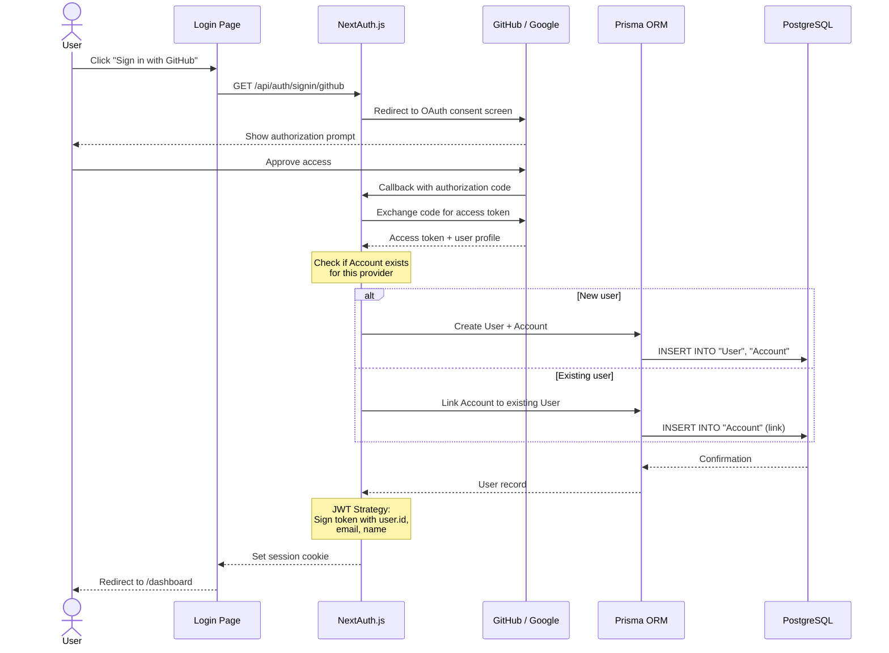
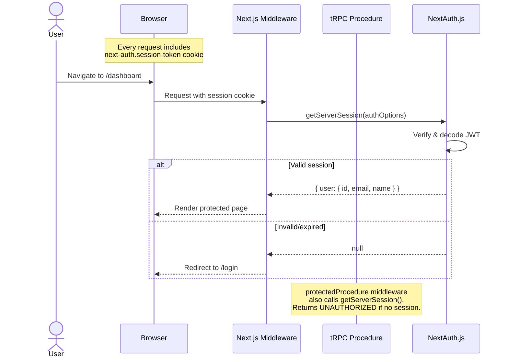

# Authentication Flow

## Credentials Login

```mermaid
sequenceDiagram
    actor User
    participant Login as Login Page
    participant NextAuth as NextAuth.js API<br/>/api/auth/[...nextauth]
    participant Prisma as Prisma ORM
    participant DB as PostgreSQL
    participant JWT as JWT Token

    User->>Login: Enter email + password
    Login->>NextAuth: POST /api/auth/callback/credentials
    NextAuth->>Prisma: findUnique({ email })
    Prisma->>DB: SELECT * FROM "User" WHERE email = ?
    DB-->>Prisma: User record
    Prisma-->>NextAuth: User with hashed password

    Note over NextAuth: bcryptjs.compare()<br/>Verify password hash

    alt Password matches
        NextAuth->>JWT: Sign JWT with user.id, email, name
        JWT-->>NextAuth: Signed token
        NextAuth-->>Login: Set session cookie (next-auth.session-token)
        Login-->>User: Redirect to /dashboard
    else Password incorrect
        NextAuth-->>Login: 401 Unauthorized
        Login-->>User: Show error message
    end
```

## OAuth Login (GitHub / Google)

```mermaid
sequenceDiagram
    actor User
    participant Login as Login Page
    participant NextAuth as NextAuth.js
    participant Provider as GitHub / Google
    participant Prisma as Prisma ORM
    participant DB as PostgreSQL

    User->>Login: Click "Sign in with GitHub"
    Login->>NextAuth: GET /api/auth/signin/github
    NextAuth->>Provider: Redirect to OAuth consent screen
    Provider-->>User: Show authorization prompt
    User->>Provider: Approve access
    Provider->>NextAuth: Callback with authorization code
    NextAuth->>Provider: Exchange code for access token
    Provider-->>NextAuth: Access token + user profile

    Note over NextAuth: Check if Account exists<br/>for this provider

    alt New user
        NextAuth->>Prisma: Create User + Account
        Prisma->>DB: INSERT INTO "User", "Account"
    else Existing user
        NextAuth->>Prisma: Link Account to existing User
        Prisma->>DB: INSERT INTO "Account" (link)
    end

    DB-->>Prisma: Confirmation
    Prisma-->>NextAuth: User record

    Note over NextAuth: JWT Strategy:<br/>Sign token with user.id,<br/>email, name

    NextAuth-->>Login: Set session cookie
    Login-->>User: Redirect to /dashboard
```

## Session Handling

```mermaid
sequenceDiagram
    actor User
    participant Browser as Browser
    participant Middleware as Next.js Middleware
    participant tRPC as tRPC Procedure
    participant NextAuth as NextAuth.js

    Note over Browser: Every request includes<br/>next-auth.session-token cookie

    User->>Browser: Navigate to /dashboard
    Browser->>Middleware: Request with session cookie
    Middleware->>NextAuth: getServerSession(authOptions)
    NextAuth->>NextAuth: Verify & decode JWT

    alt Valid session
        NextAuth-->>Middleware: { user: { id, email, name } }
        Middleware-->>Browser: Render protected page
    else Invalid/expired
        NextAuth-->>Middleware: null
        Middleware-->>Browser: Redirect to /login
    end

    Note over tRPC: protectedProcedure middleware<br/>also calls getServerSession().<br/>Returns UNAUTHORIZED if no session.
```
