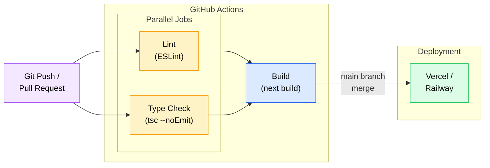

# CI/CD Pipeline

### Pipeline Stages

| Stage | Runner | Steps | Trigger |
|-------|--------|-------|---------|
| **Lint** | `ubuntu-latest` | Checkout, Setup Node 22, `npm ci`, `npm run lint` | Push to `main`, PRs to `main` |
| **Type Check** | `ubuntu-latest` | Checkout, Setup Node 22, `npm ci`, `npx prisma generate`, `npx tsc --noEmit` | Push to `main`, PRs to `main` |
| **Build** | `ubuntu-latest` | Checkout, Setup Node 22, `npm ci`, `npx prisma generate`, `npm run build` | After Lint + Type Check pass |
| **Deploy** | Vercel / Railway | Automatic deployment via platform integration | Merge to `main` |

### Key Details

- **Node.js 22** with npm cache enabled for faster installs
- **Lint** and **Type Check** run in parallel to reduce pipeline time
- **Build** depends on both parallel jobs completing successfully (`needs: [lint, type-check]`)
- **Prisma Generate** runs before type-check and build to ensure generated types are available
- Build step uses minimal environment variables (no real database required)
