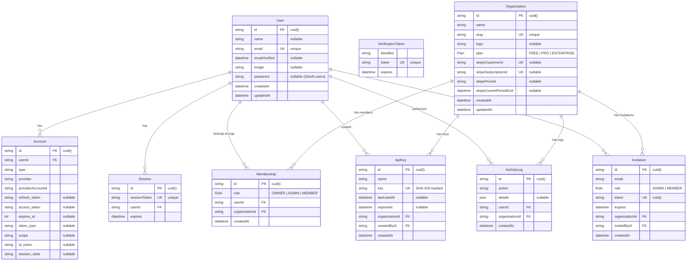

# Database Schema

```mermaid
erDiagram
    User {
        string id PK "cuid()"
        string name "nullable"
        string email UK "unique"
        datetime emailVerified "nullable"
        string image "nullable"
        string password "nullable (OAuth users)"
        datetime createdAt
        datetime updatedAt
    }

    Account {
        string id PK "cuid()"
        string userId FK
        string type
        string provider
        string providerAccountId
        string refresh_token "nullable"
        string access_token "nullable"
        int expires_at "nullable"
        string token_type "nullable"
        string scope "nullable"
        string id_token "nullable"
        string session_state "nullable"
    }

    Session {
        string id PK "cuid()"
        string sessionToken UK "unique"
        string userId FK
        datetime expires
    }

    VerificationToken {
        string identifier
        string token UK "unique"
        datetime expires
    }

    Organization {
        string id PK "cuid()"
        string name
        string slug UK "unique"
        string logo "nullable"
        Plan plan "FREE | PRO | ENTERPRISE"
        string stripeCustomerId UK "nullable"
        string stripeSubscriptionId UK "nullable"
        string stripePriceId "nullable"
        datetime stripeCurrentPeriodEnd "nullable"
        datetime createdAt
        datetime updatedAt
    }

    Membership {
        string id PK "cuid()"
        Role role "OWNER | ADMIN | MEMBER"
        string userId FK
        string organizationId FK
        datetime createdAt
    }

    Invitation {
        string id PK "cuid()"
        string email
        Role role "ADMIN | MEMBER"
        string token UK "cuid()"
        datetime expires
        string organizationId FK
        string invitedById FK
        datetime createdAt
    }

    ApiKey {
        string id PK "cuid()"
        string name
        string key UK "SHA-256 hashed"
        datetime lastUsedAt "nullable"
        datetime expiresAt "nullable"
        string organizationId FK
        string createdById FK
        datetime createdAt
    }

    ActivityLog {
        string id PK "cuid()"
        string action
        json details "nullable"
        string userId FK
        string organizationId FK
        datetime createdAt
    }

    User ||--o{ Account : "has"
    User ||--o{ Session : "has"
    User ||--o{ Membership : "belongs to orgs"
    User ||--o{ ApiKey : "created"
    User ||--o{ ActivityLog : "performed"
    User ||--o{ Invitation : "invited by"
    Organization ||--o{ Membership : "has members"
    Organization ||--o{ Invitation : "has invitations"
    Organization ||--o{ ApiKey : "has keys"
    Organization ||--o{ ActivityLog : "has logs"
```
