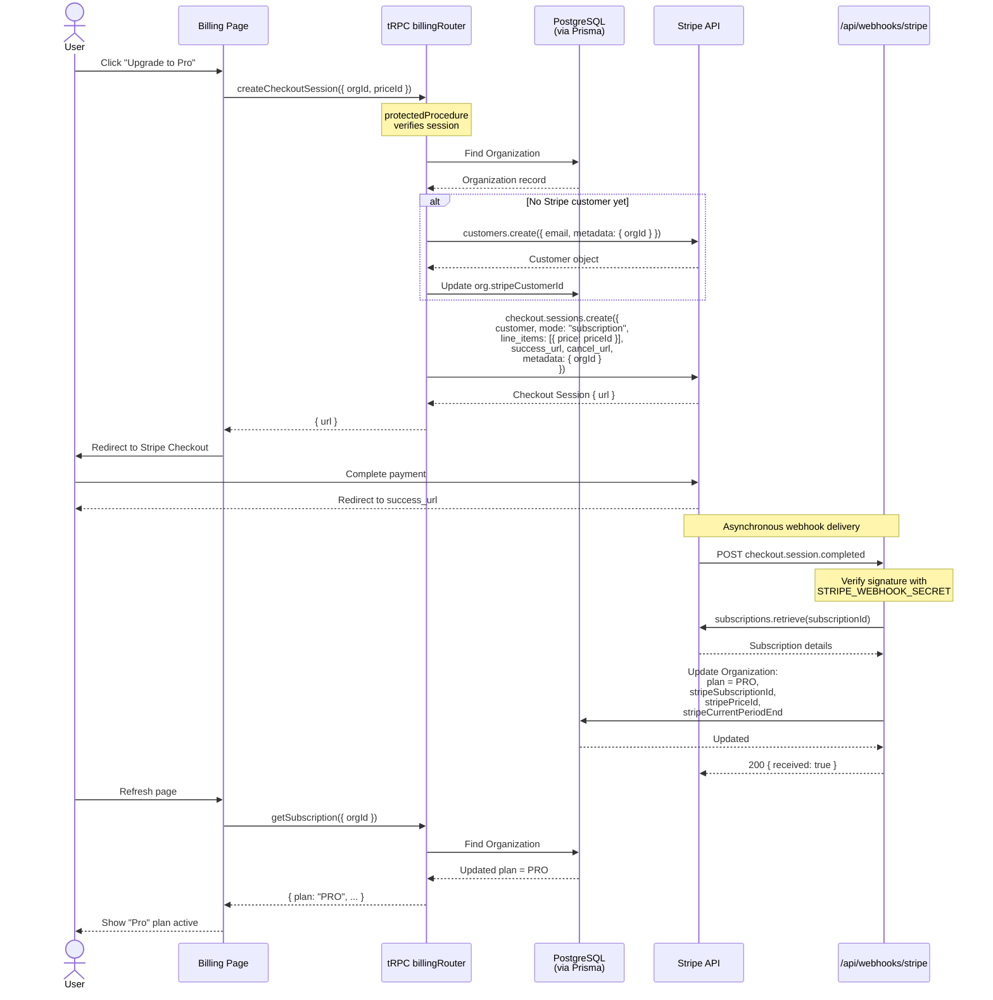
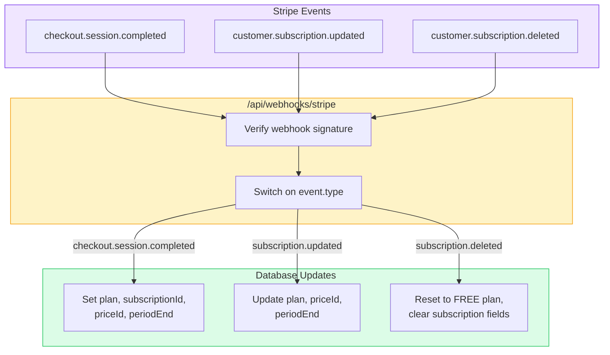
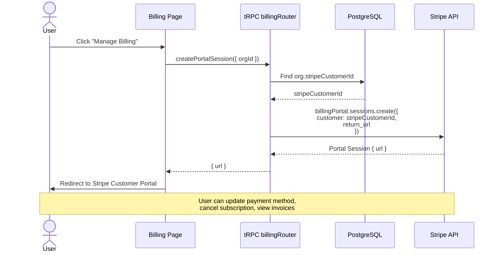

# Stripe Payment Flow

## Subscription Checkout

```mermaid
sequenceDiagram
    actor User
    participant Billing as Billing Page
    participant tRPC as tRPC billingRouter
    participant DB as PostgreSQL<br/>(via Prisma)
    participant Stripe as Stripe API
    participant Webhook as /api/webhooks/stripe

    User->>Billing: Click "Upgrade to Pro"
    Billing->>tRPC: createCheckoutSession({ orgId, priceId })

    Note over tRPC: protectedProcedure<br/>verifies session

    tRPC->>DB: Find Organization
    DB-->>tRPC: Organization record

    alt No Stripe customer yet
        tRPC->>Stripe: customers.create({ email, metadata: { orgId } })
        Stripe-->>tRPC: Customer object
        tRPC->>DB: Update org.stripeCustomerId
    end

    tRPC->>Stripe: checkout.sessions.create({<br/>  customer, mode: "subscription",<br/>  line_items: [{ price: priceId }],<br/>  success_url, cancel_url,<br/>  metadata: { orgId }<br/>})
    Stripe-->>tRPC: Checkout Session { url }
    tRPC-->>Billing: { url }
    Billing->>User: Redirect to Stripe Checkout

    User->>Stripe: Complete payment
    Stripe-->>User: Redirect to success_url

    Note over Stripe,Webhook: Asynchronous webhook delivery

    Stripe->>Webhook: POST checkout.session.completed
    Note over Webhook: Verify signature with<br/>STRIPE_WEBHOOK_SECRET
    Webhook->>Stripe: subscriptions.retrieve(subscriptionId)
    Stripe-->>Webhook: Subscription details
    Webhook->>DB: Update Organization:<br/>plan = PRO,<br/>stripeSubscriptionId,<br/>stripePriceId,<br/>stripeCurrentPeriodEnd
    DB-->>Webhook: Updated
    Webhook-->>Stripe: 200 { received: true }

    User->>Billing: Refresh page
    Billing->>tRPC: getSubscription({ orgId })
    tRPC->>DB: Find Organization
    DB-->>tRPC: Updated plan = PRO
    tRPC-->>Billing: { plan: "PRO", ... }
    Billing-->>User: Show "Pro" plan active
```

## Webhook Events

```mermaid
flowchart TD
    subgraph Stripe["Stripe Events"]
        E1["checkout.session.completed"]
        E2["customer.subscription.updated"]
        E3["customer.subscription.deleted"]
    end

    subgraph Handler["/api/webhooks/stripe"]
        V["Verify webhook signature"]
        S["Switch on event.type"]
    end

    subgraph Actions["Database Updates"]
        A1["Set plan, subscriptionId,<br/>priceId, periodEnd"]
        A2["Update plan, priceId,<br/>periodEnd"]
        A3["Reset to FREE plan,<br/>clear subscription fields"]
    end

    E1 --> V --> S
    E2 --> V
    E3 --> V

    S -->|"checkout.session.completed"| A1
    S -->|"subscription.updated"| A2
    S -->|"subscription.deleted"| A3

    style Stripe fill:#f0e6ff,stroke:#7c3aed
    style Handler fill:#fef3c7,stroke:#f59e0b
    style Actions fill:#dcfce7,stroke:#22c55e
```

## Customer Portal

```mermaid
sequenceDiagram
    actor User
    participant Billing as Billing Page
    participant tRPC as tRPC billingRouter
    participant DB as PostgreSQL
    participant Stripe as Stripe API

    User->>Billing: Click "Manage Billing"
    Billing->>tRPC: createPortalSession({ orgId })
    tRPC->>DB: Find org.stripeCustomerId
    DB-->>tRPC: stripeCustomerId
    tRPC->>Stripe: billingPortal.sessions.create({<br/>  customer: stripeCustomerId,<br/>  return_url<br/>})
    Stripe-->>tRPC: Portal Session { url }
    tRPC-->>Billing: { url }
    Billing->>User: Redirect to Stripe Customer Portal

    Note over User,Stripe: User can update payment method,<br/>cancel subscription, view invoices
```
